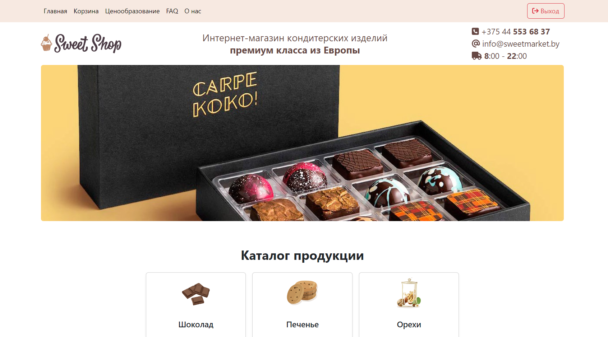

# [SweetShop](http://34.125.254.206/) - Online Candy Store

Welcome to DjangoSweetShop, an online candy store built using Django and Bootstrap. SweetShop allows users to register, browse product categories, view individual products, add them to their cart, and place orders.


## Table of Contents
- [About The Project](#about-the-project)
  - [Built With](#built-with)
- [Getting Started](#getting-started)
  - [Prerequisites](#prerequisites)
  - [Installation](#installation)
- [Usage](#usage)
- [Roadmap](#roadmap)
- [Contributing](#contributing)
- [License](#license)
- [Contact](#contact)
- [Acknowledgments](#acknowledgments)

## About The Project



SweetShop is your one-stop destination for all things sweet and delicious. Whether you're craving chocolates, gummy bears, or licorice, SweetShop has it all. Register today and start filling your cart with your favorite candies.

### Built With

SweetShop is built with the following technologies:

- Django
- Bootstrap
- HTML
- CSS

## Getting Started

To get started with SweetShop locally, follow these simple steps:

### Prerequisites

Make sure you have the following prerequisites installed:

- Python
- Pip
- Git

### Installation

1. Clone the repository
   ```sh
   git clone https://github.com/reallowcut/DjangoSweetShop.git
2. Navigate to the project directory
   ```sh
   cd DjangoSweetShop
3. Create a virtual environment (optional but recommended)
   ```sh
   python -m venv venv
4. Activate the virtual environment
   ```sh
   source venv/bin/activate
5. Install the project dependencies
   ```sh
   pip install -r requirements.txt
6. Run the Django migrations
   ```sh
   python manage.py migrate
7. Create a superuser to manage the admin panel
   ```sh
   python manage.py createsuperuser
8. Start the development server
   ```sh
   python manage.py runserver
9. Open your browser and go to http://127.0.0.1:8000/ to access SweetShop.

## Usage

SweetShop provides a user-friendly interface for the following actions:

- Register an account
- Browse product categories
- View individual product details
- Add products to your cart
- Place orders

## Roadmap

Here are some planned features and improvements for DjangoSweetShop:

- [ ] Implement a user profile page
- [ ] Add payment processing functionality
- [ ] Allow users to rate products
- [ ] Implement a search feature
- [ ] Improve the user interface and design


## Contributing

Contributions to DjangoSweetShop are welcome and appreciated. If you have suggestions or would like to contribute, please follow these steps:

1. Fork the project
2. Create a feature branch (`git checkout -b feature/AmazingFeature`)
3. Commit your changes (`git commit -m 'Add some AmazingFeature'`)
4. Push to the branch (`git push origin feature/AmazingFeature`)
5. Open a pull request

Don't forget to give the project a star if you find it useful!

## Contact

If you have any questions or need assistance, you can reach out to us at:

- Maxim Drogan - [TG](https://t.me/reallowcut) - droganpythonpro@gmail.com
- Project Link: [https://github.com/reallowcut/DjangoSweetShop.git](https://github.com/reallowcut/DjangoSweetShop.git)

## Acknowledgments

We'd like to give credit to the following resources that have been helpful in building DjangoSweetShop:

- [Django Documentation](https://docs.djangoproject.com/)
- [Bootstrap Documentation](https://getbootstrap.com/docs/)
- [Font Awesome Icons](https://fontawesome.com/icons)
- [DjangoGirls Tutorial](https://tutorial.djangogirls.org/)
- [GitHub Pages](https://pages.github.com/)
